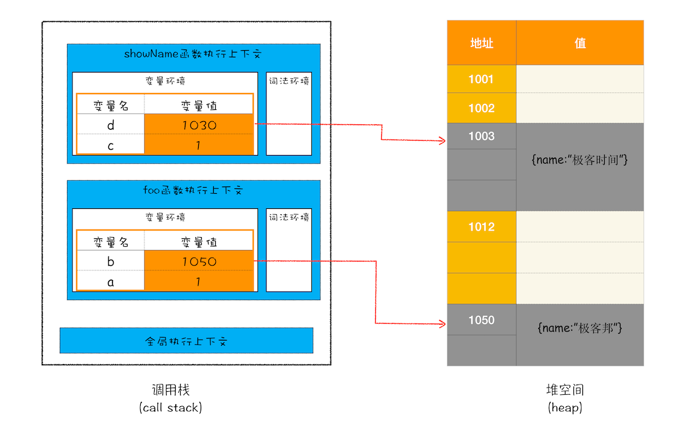

# 垃圾回收：垃圾数据是如何自动回收的
**产生的垃圾数据是由垃圾回收器来释放的**

## 调用栈中的数据是如何回收的
```
function foo(){
    var a = 1
    var b = {name:" 极客邦 "}
    function showName(){
      var c = " 极客时间 "
      var d = {name:" 极客时间 "}
    }
    showName()
}
foo()

```
  

调用栈中有一个**记录当前执行状态的指针(称为ESP)**,指向正在执行的showName函数的执行上下文。  
当函数执行流程进入foo函数时，ESP会下移到foo函数的执行上下文。**这个下移操作就是销毁showName函数执行上下文的过程**  

  

当一个函数执行结束后，**javascript引擎会通过向下移动ESP来销毁该函数保存在栈中的执行上下文**

## 堆中的数据是如何回收的
foo函数执行结束后的内存状态  

  

**要回收堆中的垃圾数据，需要用到JavaScript中的垃圾回收器**

## 代际假说和分代收集
代际假说(The Generational Hypothesis)的特点  
- 1.第一个是大部分对象在内存中存在的时间很短，简单来说，就是很多对象一经分配内存，很快就变得不可访问
- 2.不死的对象，会活得更久

V8中会把堆分为**新生代**和**老生代**两个区域，**新生代中存放的是生存时间短的对象，老生代中存放的生存时间久的对象。**  

- 副垃圾回收器，主要负责新生代的垃圾回收
- 主垃圾回收器，主要负责老生代的垃圾回收


**不论什么类型的垃圾回收器，他们都有一套共同的执行流程**  
- 1.标记空间中活动对象(还在使用)和非活动对象(可以进行垃圾回收)
- 2.回收非活动对象所占据的内存
- 3.内存整理。清理内存中存在的不连续的内存空间(内存碎片)。


## 副垃圾回收器
  

新生代中用Scavenge算法将新生代空间分成一半的对象区域，一半的空闲区域。  

新加入的对象存放到对象区域，垃圾回收后将存活的对象复制到空闲空间，进行角色翻转，将原来的对象区域变成空闲区域，空闲变成对象区域。  

**对象晋升策略**，经过两次垃圾回收依然存活的对象，会被移动到老生区中。

## 主垃圾回收器
主垃圾回收器主要负责老生区中的垃圾回收。  
老生区中对象特点：  
1.对象占用空间大  
2.对象存活时间长  


主垃圾回收器采用**标记-清除(Mark-Sweep)算法**进行垃圾回收  
1.标记过程阶段。遍历元素，能达到的元素称为“活动对象”，没有达到的元素判断为“垃圾数据”  
  

2.垃圾的清除过程。将标记的元素清除掉  
  

3.整理。让所有存活的对象向一端移动，然后直接清除掉端边界以外的内存  
  

## 全停顿
**全停顿(Stop-The-World)**:  
由于JS是运行在主线程之上的，一旦执行垃圾回收算法，都需要将正在执行的JS脚本暂停下来，待垃圾回收完毕后再恢复脚本执行。  


**增量标记(Incremental Marking)算法**：为了降低老生代的垃圾回收而造成的卡顿，V8将标记过程分为一个个的子标记过程，同时让垃圾回收标记和JS应用逻辑交替进行，直到标记阶段完成。  


## 判断JS中内存泄漏，以及应对方法
1. 如何判断内存泄漏的？一般是感官上的长时间运行页面卡顿，猜可能会有内存泄漏。通过DynaTrace（IE）profiles等工具一段时间收集数据，观察对象的使用情况。然后判断是否存在内存泄漏。修改后验证
2. 工作中避免内存泄漏方法：确定不使用的临时变量置为null，当前es6普及场景下少使用闭包也是一种方法。