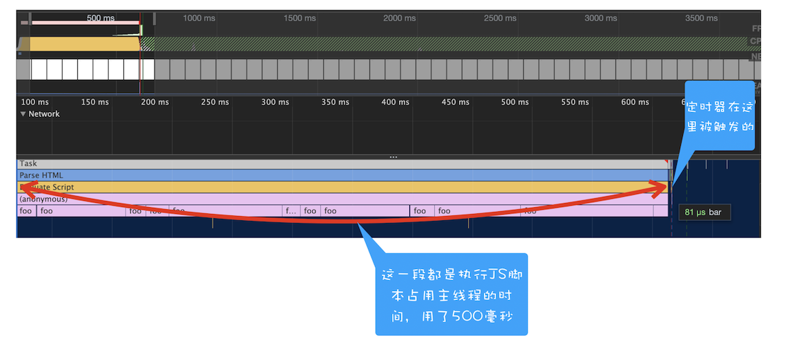

# WebAPI:setTimeout是如何实现的
setTimeout:用来指定某个函数在多少毫秒之后执行。  
```
function showName(){
  console.log(" 极客时间 ")
}
var timerID = setTimeout(showName,200);

```

## 浏览器怎么实现setTimeout
在Chrome中除了正常使用的消息队列之外，还有另外一个消息队列，这个队列中维护了需要延迟执行的任务列表，包括了定时器和Chromium内部一些需要延迟执行的任务。所以当通过JavaScript创建一个定时器时，渲染进程会将该定时器的回调任务添加到延迟队列中。

## 使用setTimeout的一些注意事项
### 1.如果当前任务执行时间过久，会影响延迟到期定时器任务的执行
```
function bar() {
    console.log('bar')
}
function foo() {
    setTimeout(bar, 0);
    for (let i = 0; i < 5000; i++) {
        let i = 5+8+8+8
        console.log(i)
    }
}
foo()

```


### 2.如果setTimeout存在嵌套调用，那么系统会设置最短时间间隔为4毫秒
```
function cb() { setTimeout(cb, 0); }
setTimeout(cb, 0);

```
  

在Chrome中，定时器被嵌套调用5次以上，系统会判断该函数方法被阻塞了，如果定时器的调用时间间隔小于4毫秒，那么浏览器会将每次调用的时间间隔设置为4毫秒。

### 3.未激活的页面，setTimeout执行最小间隔是1000毫秒
如果标签不是当前的激活标签，那么定时器最小的时间间隔是1000毫秒，目的是为了优化后台页面的加载损耗以及降低耗电量。

### 4.延时执行时间有最大值
### 5.使用setTimeout设置的回调函数中的this不符合直觉
如果被setTimeout推迟执行的回调函数是某个对象的方法，那么该方法中的this关键字将指向全局环境，而不是定义时的那个对象。
```
var name= 1;
var MyObj = {
  name: 2,
  showName: function(){
    console.log(this.name);
  }
}
setTimeout(MyObj.showName,1000)

//输出1
```
这段代码在编译的时候，执行上下文的this会被设置为全局window,如果是严格模式，会被设置为undefined  

解决方法：
```
// 箭头函数
setTimeout(() => {
    MyObj.showName()
}, 1000);
// 或者 function 函数
setTimeout(function() {
  MyObj.showName();
}, 1000)

```

```
setTimeout(MyObj.showName.bind(MyObj), 1000)

```