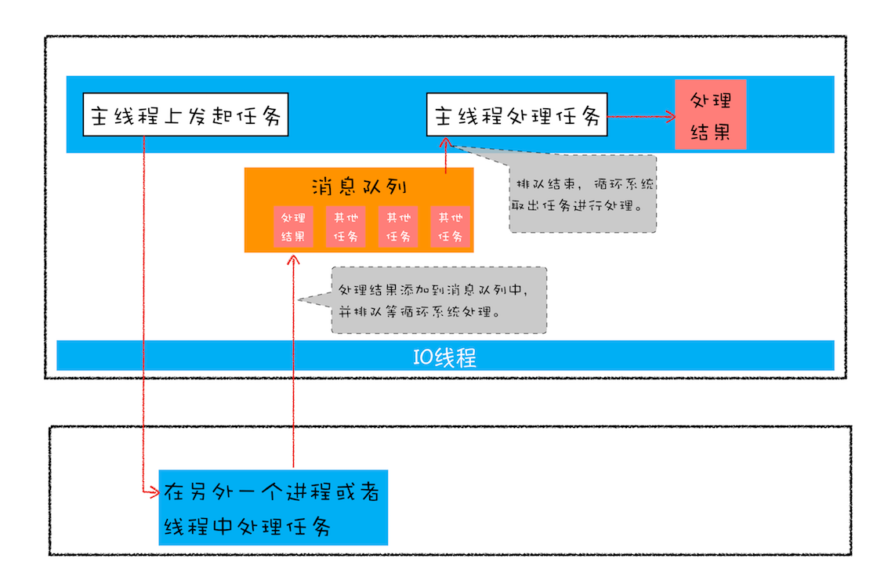
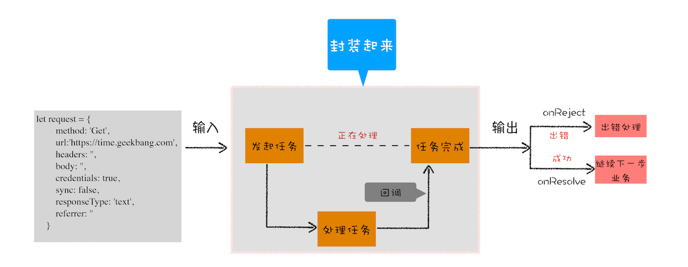
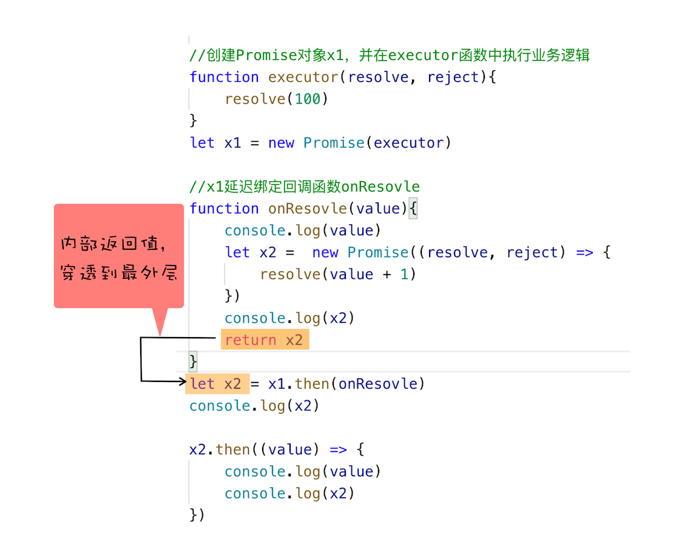

# Promise:使用Promise，告别回调函数
## 异步编程的问题：代码逻辑不连续
  

```
// 执行状态
function onResolve(response){console.log(response) }
function onReject(error){console.log(error) }

let xhr = new XMLHttpRequest()
xhr.ontimeout = function(e) { onReject(e)}
xhr.onerror = function(e) { onReject(e) }
xhr.onreadystatechange = function () { onResolve(xhr.response) }

// 设置请求类型，请求 URL，是否同步信息
let URL = 'https://time.geekbang.com'
xhr.open('Get', URL, true);

// 设置参数
xhr.timeout = 3000 // 设置 xhr 请求的超时时间
xhr.responseType = "text" // 设置响应返回的数据格式
xhr.setRequestHeader("X_TEST","time.geekbang")

// 发出请求
xhr.send();

```

## 封装异步代码，让处理流程变得线性
  

1. 把输入的HTTP请求消息全部保存到一个request的结构中  
```
//makeRequest 用来构造 request 对象
function makeRequest(request_url) {
    let request = {
        method: 'Get',
        url: request_url,
        headers: '',
        body: '',
        credentials: false,
        sync: true,
        responseType: 'text',
        referrer: ''
    }
    return request
}

```

2. 封装请求过程，将请求细节封装进XFetch函数  
   
```
//[in] request，请求信息，请求头，延时值，返回类型等
//[out] resolve, 执行成功，回调该函数
//[out] reject  执行失败，回调该函数
function XFetch(request, resolve, reject) {
    let xhr = new XMLHttpRequest()
    xhr.ontimeout = function (e) { reject(e) }
    xhr.onerror = function (e) { reject(e) }
    xhr.onreadystatechange = function () {
        if (xhr.status = 200)
            resolve(xhr.response)
    }
    xhr.open(request.method, URL, request.sync);
    xhr.timeout = request.timeout;
    xhr.responseType = request.responseType;
    // 补充其他请求信息
    //...
    xhr.send();
}

```
业务代码  
```
XFetch(makeRequest('https://time.geekbang.org'),
    function resolve(data) {
        console.log(data)
    }, function reject(e) {
        console.log(e)
    })

```

## 回调地狱
```
XFetch(makeRequest('https://time.geekbang.org/?category'),
      function resolve(response) {
          console.log(response)
          XFetch(makeRequest('https://time.geekbang.org/column'),
              function resolve(response) {
                  console.log(response)
                  XFetch(makeRequest('https://time.geekbang.org')
                      function resolve(response) {
                          console.log(response)
                      }, function reject(e) {
                          console.log(e)
                      })
              }, function reject(e) {
                  console.log(e)
              })
      }, function reject(e) {
          console.log(e)
      })

```

## Promise：消灭嵌套调用和多次错误处理
使用Promise重构XFetch的代码
```
function XFetch(request) {
  function executor(resolve, reject) {
      let xhr = new XMLHttpRequest()
      xhr.open('GET', request.url, true)
      xhr.ontimeout = function (e) { reject(e) }
      xhr.onerror = function (e) { reject(e) }
      xhr.onreadystatechange = function () {
          if (this.readyState === 4) {
              if (this.status === 200) {
                  resolve(this.responseText, this)
              } else {
                  let error = {
                      code: this.status,
                      response: this.response
                  }
                  reject(error, this)
              }
          }
      }
      xhr.send()
  }
  return new Promise(executor)
}

```
利用XFetch来构造请求流程
```
var x1 = XFetch(makeRequest('https://time.geekbang.org/?category'))
var x2 = x1.then(value => {
    console.log(value)
    return XFetch(makeRequest('https://www.geekbang.org/column'))
})
var x3 = x2.then(value => {
    console.log(value)
    return XFetch(makeRequest('https://time.geekbang.org'))
})
x3.catch(error => {
    console.log(error)
})

```
- 首先引入Promise,在调用XFetch时，返回一个Promise对象
- 构建Promise对象时，需要传入一个executor函数，XFetch的主要业务流程都在executor函数中执行
- 如果运行在excutor函数中的业务执行成功了，会调用resolve函数；如果执行失败了，则调用reject函数
- 在excutor函数中调用resolve函数时，会触发promise.then设置的回调函；而调用reject函数时，会触发promise.catch设置的回调函数


### Promise解决嵌套回调问题
1. Promise实现了回调函数的延时绑定  
```
// 创建 Promise 对象 x1，并在 executor 函数中执行业务逻辑
function executor(resolve, reject){
    resolve(100)
}
let x1 = new Promise(executor)


//x1 延迟绑定回调函数 onResolve
function onResolve(value){
    console.log(value)
}
x1.then(onResolve)

```
2. 需要将回调函数onResolve的返回值穿透到最外层    

  

## 思考题

1、Promise 中为什么要引入微任务？

由于promise采用.then延时绑定回调机制，而new Promise时又需要直接执行promise中的方法，即发生了先执行方法后添加回调的过程，此时需等待then方法绑定两个回调后才能继续执行方法回调，便可将回调添加到当前js调用栈中执行结束后的任务队列中，由于宏任务较多容易堵塞，则采用了微任务

2、Promise 中是如何实现回调函数返回值穿透的？  
首先Promise的执行结果保存在promise的data变量中，然后是.then方法返回值为使用resolved或rejected回调方法新建的一个promise对象，即例如成功则返回new Promise（resolved），将前一个promise的data值赋给新建的promise

3、Promise 出错后，是怎么通过“冒泡”传递给最后那个捕获  
promise内部有resolved_和rejected_变量保存成功和失败的回调，进入.then（resolved，rejected）时会判断rejected参数是否为函数，若是函数，错误时使用rejected处理错误；若不是，则错误时直接throw错误，一直传递到最后的捕获，若最后没有被捕获，则会报错。可通过监听unhandledrejection事件捕获未处理的promise错误
