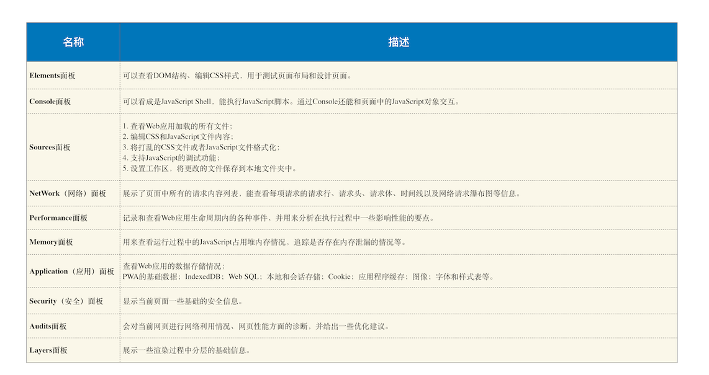

# Chrome开发者工具：利用网络面板做性能分析  

  

## 网络面板
  

### 1.控制器

### 2.过滤器
通过过滤器筛选需要的文件类型

### 3.抓图信息
抓图信息区域，可以用来分析用户等待页面加载时间内所看到的内容，分析用户实际的体验情况。

### 4.时间线
时间线，主要用来展示HTTP、HTTPS、WebSocket加载的状态和时间的一个关系，用于直观感受页面的加载过程。

### 5.详细列表
它详细记录了每个资源从发起请求到完成请求这中间所有过程的状态，以及最终请求完成的数据信息。

### 6.下载信息概要
- DOMContentLoaded,这个事件发生后，说明页面已经构建好DOM了，这意味着构建DOM所需要的HTML文件、JavaScript文件、CSS文件都已经下载完成了
- Load,说明浏览器已经加载了所有的资源(图像、样式表等)

## 网络面板中的详细列表
### 1.列表的属性
默认情况下，列表是按请求发起的时间来排序的，最早发起请求的资源在顶部。当然也可以按照返回状态码、请求类型、请求时长、内容大小等基础属性排序。  
  

### 2.详细信息
  

### 3.单个资源的时间线
  

  

1. Queuing,排队。当浏览器发起一个请求的时候，会有很多原因导致该请求不能被立即执行，而是需要排队等待。  
   - 页面中的资源是有优先级的。CSS、HTML、JavaScript等都是页面中的核心文件，优先级最高；而图片、视频、音频这类资源优先级较低。当后者遇到前者时，就需要让路，进入待排队状态。
   - 浏览器会为每个域名最多维护6个TCP连接，如果发起一个HTTP请求时，这6个TCP连接都处于忙碌状态，那么请求就会处于排队状态
   - 网络进程在为数据分配磁盘空间时，新的HTTP请求也需要短暂地等待磁盘分配结束。

2. Stalled:因为一些原因导致连接过程停滞
3. Proxy Negotiation:代理协商阶段，表示代理服务器连接协商所用的时间
4. Initial connection/SSL阶段：和服务器建立连接的阶段
5. Request sent阶段：服务器建立好连接后，网络进程会准备请求数据，并将其发送给网络
6. Waiting(TTFB)：第一字节时间。数据发送出去后，等待接收服务器第一个字节的数据。是反应服务端响应速度的重要指标。
7. Content Download阶段：从第一字节时间到接收到全部响应数据所用的时间

## 优化时间线上耗时项
### 1.排队(Queuing)时间过久
- 域名分片技术：让一个站点下面的资源放在多个域名下面
- 把站点升级到**HTTP2**,因为HTTP2已经没有每个域名最多维护6个TCP连接的限制

### 2.第一字节时间(TTFB)时间过久
- 服务器生成页面数据的时间过久。
- 网络原因。
- 发送请求头时带上了多余的用户信息。比如一些多余的cookie信息。

### 3.Content Download时间过久