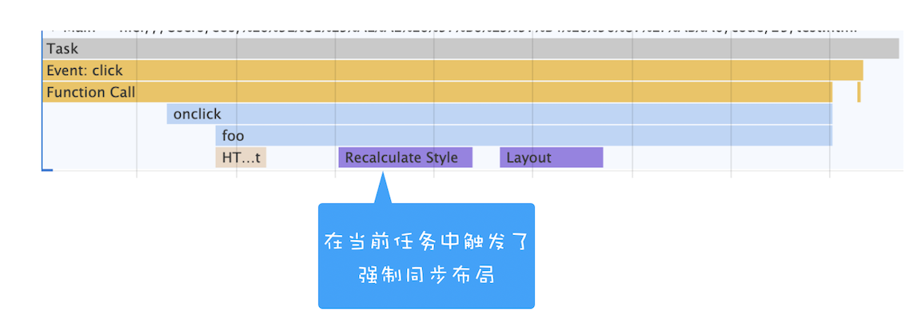
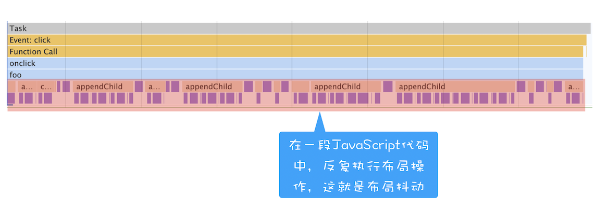

# 页面性能：如何系统地优化页面

页面生存周期的不同阶段：  
- **加载阶段**，是指从发出请求到渲染出完整页面的过程，影响到这个阶段的主要因素有网络和JS脚本
- **交互阶段**，主要是从页面加载完成到用户交互的整合过程，影响到这个阶段的主要因素是JS脚本
- **关闭阶段**，主要是用户发出关闭指令后页面所做的一些清理操作

## 加载阶段
  

能阻塞网页首次渲染的资源称为关键资源  

三个影响页面首次渲染的核心因素：  
1. 关键资源个数
2. 关键资源大小
3. 请求关键资源需要多少个RTT(Round Trip Time)  

**RTT**是TCP协议传输中的**往返时延**。它是网络中一个重要的性能指标，表示从发送端发送数据开始，到发送端收到来自接收端的确认，总共经历的时延。通常1个HTTP的数据包在14KB左右，所以1个0.1M的页面就需要拆分成8个包来传输了，也就是说需要8个RTT。  

**总的优化原则就是减少关键资源个数，减低关键资源大小，降低关键资源的RTT次数**  

### 如何减少关键资源的个数？
- 将JS和CSS改成内联的形式
- 如果JS代码没有DOM或CSSOM的操作，则可以改成sync或defer属性

### 如何减少关键资源的大小
压缩资源，移除注释

### 如何减少关键资源的RTT的次数
使用CDN来减少每次RTT时长


## 交互阶段
谈交互阶段的优化，其实就是在谈论渲染进程渲染帧的速度，因为在交互阶段，帧的渲染速度决定了交互的流畅度。  

  

**一个大的原则就是让单个帧的生成速度变快**  

### 1.减少JS脚本执行时间
JS函数执行过久会严重霸占主线程执行其他渲染任务的时间，解决策略：  

- 将一次执行的函数分解为多个任务，使得每次的执行时间不要过久
- 采用Web Workers。Web Workers是主线程外的一个线程，其没办法访问DOM。

### 2.避免强制同步布局
通过DOM接口执行添加元素或者删除元素等操作后，需要重新计算样式和布局，正常是异步完成，避免占用太长的主线程时间

```
<html>
<body>
    <div id="mian_div">
        <li id="time_li">time</li>
        <li>geekbang</li>
    </div>

    <p id="demo"> 强制布局 demo</p>
    <button onclick="foo()"> 添加新元素 </button>

    <script>
        function foo() {
            let main_div = document.getElementById("mian_div")      
            let new_node = document.createElement("li")
            let textnode = document.createTextNode("time.geekbang")
            new_node.appendChild(textnode);
            document.getElementById("mian_div").appendChild(new_node);
        }
    </script>
</body>
</html>

```
  

执行JS添加元素是在一个任务中执行的，重新计算样式布局是在另外一个任务中执行的。  

**所谓强制同步布局，是指JS强制将计算样式和布局操作提前到当前的任务中**  

```
function foo() {
    let main_div = document.getElementById("mian_div")
    let new_node = document.createElement("li")
    let textnode = document.createTextNode("time.geekbang")
    new_node.appendChild(textnode);
    document.getElementById("mian_div").appendChild(new_node);
    // 由于要获取到 offsetHeight，
    // 但是此时的 offsetHeight 还是老的数据，
    // 所以需要立即执行布局操作
    console.log(main_div.offsetHeight)
}

```
调用main_div.offsetHeight来获取新main_div的高度信息，需要重新布局才能获取新的高度信息，所以JS需要强制让渲染引擎默认执行一次布局操作。这就是强制同步布局  

  

计算样式和布局都在当前脚本执行过程中触发，这就是强制同步布局  

```
function foo() {
    let main_div = document.getElementById("mian_div")
    // 为了避免强制同步布局，在修改 DOM 之前查询相关值
    console.log(main_div.offsetHeight)
    let new_node = document.createElement("li")
    let textnode = document.createTextNode("time.geekbang")
    new_node.appendChild(textnode);
    document.getElementById("mian_div").appendChild(new_node);
    
}

```

### 3.避免布局抖动
所谓布局抖动，是指在一次JS执行过程中，多次执行强制布局和抖动操作  

```
function foo() {
    let time_li = document.getElementById("time_li")
    for (let i = 0; i < 100; i++) {
        let main_div = document.getElementById("mian_div")
        let new_node = document.createElement("li")
        let textnode = document.createTextNode("time.geekbang")
        new_node.appendChild(textnode);
        new_node.offsetHeight = time_li.offsetHeight;
        document.getElementById("mian_div").appendChild(new_node);
    }
}

```


### 4.合理利用CSS合成动画
合成动画是直接在合成线程上执行的，不会占用主线程。  

利用will-change告诉渲染引擎需要将该元素单独生成一个图层

### 5.避免频繁的垃圾回收
JS使用自动垃圾回收机制，所以要尽可能优化存储结构，尽可能避免小颗粒对象的产生。