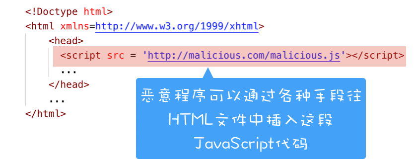

# 32.同源策略：为什么XMLHttpRequest不能跨域请求资源

## 什么是同源策略
**如果两个URL的协议、域名和端口都相同，我们就称这两个URL同源**  

```
https://time.geekbang.org/?category=1
https://time.geekbang.org/?category=0

```
浏览器默认两个相同的源之间是可以相互访问资源和操作DOM的。两个不同的源之间若想要互相访问资源或者操作DOM，那么会有一套基础的安全策略的制约，我们把这称为**同源策略**  

同源策略主要表现在DOM、Web数据和网络三个方面

### DOM层面
同源策略限制了来自不同源的JS脚本对当前DOM对象读和写操作

### 数据层面
同源策略限制了不同源的站点读取当前站点的Cookie、IndexDB、LocalStorage等数据

### 网络层面
同源策略限制通过XMLHttpRequest等方式将站点的数据发送给不同源的站点

## 安全和便利性的权衡
### 1.页面中可以嵌入第三方资源
  

为了解决XSS攻击，浏览器中引入了内容安全策略，称为CSP。**CSP的核心思想是让服务器决定浏览器能够加载哪些资源，让服务器决定浏览器是否能够执行内联JS代码**

### 2.跨域资源共享和跨文档消息机制

**跨域资源共享(CORS)**,使用该机制可以进行跨域访问控制，从而使跨域数据传输得以安全进行  

浏览器中引入**跨文档消息机制**，可以通过window.postMessage的JS接口来和不同源的DOM进行通信