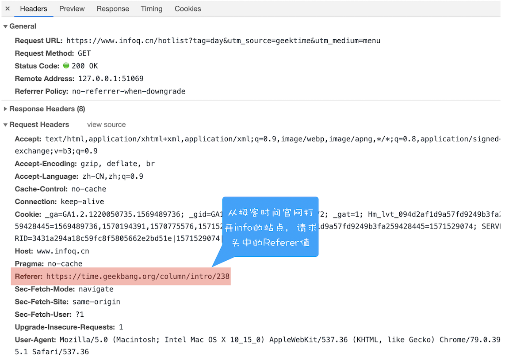
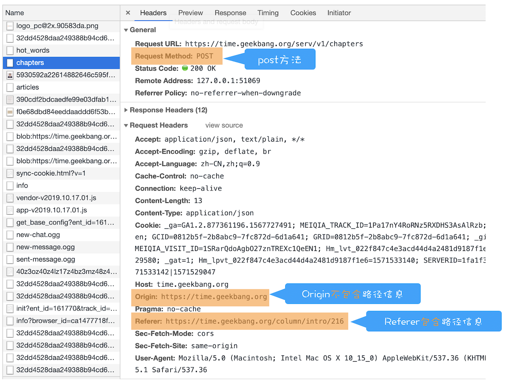

# CSRF攻击
CSRF(Cross-site request forgery),"跨站请求伪造"，是指黑客引诱用户打开黑客的网站，在黑客的网站中，利用用户的登录状态发起的跨站请求。   
**和XSS不同，CSRF攻击不需要将恶意代码注入到用户的页面，仅仅是利用服务器的漏洞和用户的登录状态来实施攻击。** 
## 三种方式
具有转账功能的网站  
```

# 同时支持 POST 和 Get
# 接口 
https://time.geekbang.org/sendcoin
# 参数
## 目标用户
user
## 目标金额
number
```
### 1.自动发起Get请求
```

<!DOCTYPE html>
<html>
  <body>
    <h1> 黑客的站点：CSRF 攻击演示 </h1>
    
  </body>
</html>
```
黑客将转账的请求接口隐藏在img标签中，伪装为图片资源，被加载时，浏览器自动发起img的资源请求，如果服务器没有对该请求做判断的话，那么服务器就会认为该请求是一个转账请求。

### 2.自动发起POST请求
```

<!DOCTYPE html>
<html>
<body>
  <h1> 黑客的站点：CSRF 攻击演示 </h1>
  <form id='hacker-form' action="https://time.geekbang.org/sendcoin" method=POST>
    <input type="hidden" name="user" value="hacker" />
    <input type="hidden" name="number" value="100" />
  </form>
  <script> document.getElementById('hacker-form').submit(); </script>
</body>
</html>
```
黑客在页面构建一个**隐藏的表单**，内嵌转账接口，当用户打开站点后，表单会自动执行提交；表单提交后，服务器就会执行转账操作。

### 3.引诱用户点击链接
```

<div>
   </img> </div> <div>
  <a href="https://time.geekbang.org/sendcoin?user=hacker&number=100" taget="_blank">
    点击下载美女照片
  </a>
</div>
```
将转账接口伪装为图片下载地址

## 如何防止CSRF攻击
CSRF攻击的三个必要条件  
- 目标站点一定要有CSRF漏洞
- 用户要登录过目标站点，并且在浏览器上保持有该站点的登录状态
- 需要用户打开一个第三方站点，可以是黑客的站点，也可以是一些论坛

### 1.充分利用好Cookie的SameSite属性
**Cookie是浏览器和服务器之间维护登录状态的一个关键数据**  
通常CSRF攻击都是从第三方站点发起的，要防止CSRF攻击，最好实现从第三方站点发送请求时禁止Cookie的发送。  
- 如果是从第三方站点发起的请求，那么需要浏览器禁止发送某些关键Cookie数据到服务器
- 如果是同一个站点发起的请求，那么就需要保证Cookie数据正常发送  

在HTTP相应头中，通过set-cookie字段设置Cookie时，可以带上SameSite选项   
```

set-cookie: 1P_JAR=2019-10-20-06; expires=Tue, 19-Nov-2019 06:36:21 GMT; path=/; domain=.google.com; SameSite=none
```
**SameSite选项通常有Strict、Lax和None三个值**  
- 如果SameSite的值是Strict,那么浏览器会完全禁止第三方Cookie
- Lax。在跨站点的情况下，从第三方站点的链接打开和从第三方站点提交Get方式的表单这两种方式都会携带Cookie。但如果在第三方站点中使用Post方法，或者通过img、iframe等标签加载的URL，这些场景都不会携带Cookie
- None。在任何情况下都会发送Cookie数据

### 2.验证请求的来源站点
**在服务器端验证请求来源的站点**  
- Referer是HTTP请求头中的一个字段，记录了该HTTP请求的来源地址  

  

- Origin属性：在一些重要的场合，比如通过XMLHttpRequest、Fecth发起跨站请求或者通过Post方法发送请求时，都会带上Origin属性  

  

服务器的策略是优先判断Origin，如果请求头中没有包含Origin属性，再根据实际情况判断是否使用Referer值

### 3.CSRF Token
1. 在浏览器向服务器发起请求时，服务器生成一个CSRF Token。CSRF Token其实就是服务器生成的字符串，然后将该字符串植入到返回的页面中。

```

<!DOCTYPE html>
<html>
<body>
    <form action="https://time.geekbang.org/sendcoin" method="POST">
      <input type="hidden" name="csrf-token" value="nc98P987bcpncYhoadjoiydc9ajDlcn">
      <input type="text" name="user">
      <input type="text" name="number">
      <input type="submit">
    </form>
</body>
</html>
```
2. 在浏览器端如果要发起转账的请求，那么需要带上页面中的CSRF Token，然后服务器会验证该Token是否合法。如果是从第三方站点发起请求，那么将无法获取到CSRF Token的值，所以即使发起了请求，服务器也会因为CSRF Token不正确而拒绝请求。