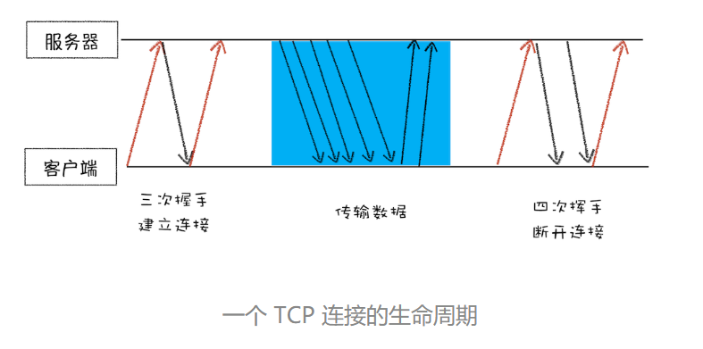

# TCP协议：如何保证页面文件能被完整送达浏览器
## 数据包的传输
- IP：把数据包送达目的主机
- UDP：把数据包送达应用程序
- TCP：把数据完整地送达应用程序

### IP：把数据包送达目的主机
计算机的地址称为IP地址，访问任何网站实际上只是你的计算机向另外一台计算机请求信息。

### UDP：把数据包送达应用程序
用户数据包协议(User Datagram Protocol),简称UDP  
UDP中最重要的信息是**端口号**  
IP通过IP地址信息把数据包发送给指定的电脑，而UDP通过端口号把数据包分发给正确的程序

### TCP：把数据完整地送达应用程序
TCP(Transmission Control Protocol,传输控制协议)是一种面向连接的、可靠的、基于字节流的传输层通信协议。  
- 对于数据包丢失的情况，TCP提供重传机制
- TCP传入了数据包排序机制，用来保证把乱序的数据包组合成一个完整的文件

### TCP连接过程
- 建立连接
- 传输数据
- 断开连接

