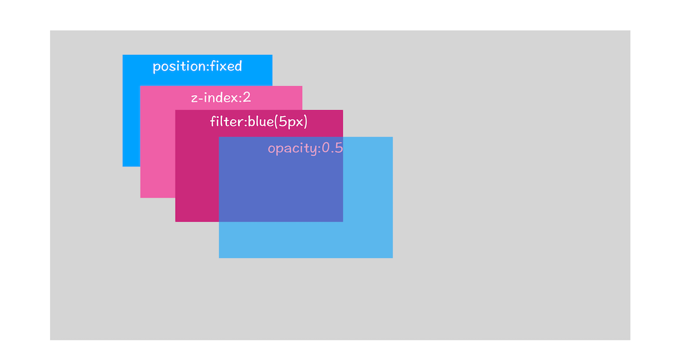

# 渲染流程：HTNL、CSS和JavaScript，是如何变成页面的？
- 构建DOM树
- 样式计算
- 布局阶段
- 分层
- 绘制
- 分块
- 光栅化
- 合成

## 1.构建DOM树

## 2.样式计算(Recalculate Style)
- 把CSS转化为浏览器能够理解的结构
- 转换样式表中的属性值，使其标准化
- 计算出DOM树中每个节点的具体样式

### 2.1把CSS转化为浏览器能够理解的结构
当渲染引擎接收到CSS文本时，会执行一个转换操作，将CSS文本转换为浏览器可以理解的结构--styleSheets
### 2.2转换样式表中的属性值，使其标准化

### 2.3计算出DOM树中每个节点的具体样式
- CSS继承规则  
  CSS继承就是每个DOM节点都包含有父节点的样式
- 层叠规则

## 3.布局阶段
- 创建布局树
- 布局计算

### 3.1创建布局树
构建一颗只包含**可见元素**布局树  

### 3.2布局计算
计算每个元素的几何坐标位置，并将这些信息保存在布局树中。

## 4.分层
渲染引擎需要为特点的节点生成专用的图层，并生成一颗对应的图层树(LayerTree)  
  
并不是布局树的每个节点都包含一个图层，如果一个节点没有对应的层，那么这个节点就从属于父节点的图层。  
- 渲染引擎怎样才会为特定的节点创建新的层

1. 拥有层叠上下文属性的元素会被提升为单独的一层  
     
  
2. 需要剪裁(clip)的地方才会被创建为图层  
   内容超出容器

## 5.图层绘制
把一个图层的绘制拆分成很多小的绘制指令，然后再把这些指令按照顺序组成一个待绘制列表。

## 6.栅格化(raster)操作
绘制列表只是用来记录绘制顺序和绘制指令的列表，而实际上绘制操作是由渲染引擎中的合成线程来完成的。  
  

- 屏幕上页面的可见区域叫做视口(ViewPort)
- 为减小开销，合成线程会将图层划分为图块(tile)  
    
**合成线程会按照视口附近的图块来优先生成位图，实际生成位图的操作是由栅格化来执行。所谓栅格化，是指将图块转换为位图。**  
  
- 使用GPU来加速生成位图的过程叫做快速栅格化或GPU栅格化，生成的位图被保存在GPU内存中  
  

## 7.合成和显示
一旦所有图块都被光栅化，合成线程就会生成一个绘制图块的命令--'DrawQuad'，然后将该命令提交给浏览器进程。然后由其viz组件将页面内容绘制到内存中，最后将内存显示在屏幕上。  

## 总结
  


1. 渲染过程将HTML内容转换为DOM树结构
2. 渲染引擎将CSS样式表转化为styleSheets,计算出DOM节点的样式
3. 创建布局树，并计算元素的布局信息
4. 对布局树进行分层，并生成分层树
5. 为每个图层生成绘制列表，并将其提交到合成线程
6. 合成线程将图层分成图块，并在光栅化线程池中将图块转换成位图
7. 合成线程发送绘制图块命令DrawQuad给浏览器进程
8. 浏览器进程根据DrawQuad消息生成页面，并显示在显示器上。

## 相关概念
### 1.更新了元素的几何属性(重排)   
高度、宽度等  

  

浏览器会触发重新布局，解析之后的一系列子阶段。  
**重排需要更新完整的渲染流水线，所以开销最大。**

### 2.更新元素的绘制属性(重绘)
背景颜色等。  
   

**重绘省去了布局和分层阶段**

### 3.直接合成阶段
利用transform实现动画效果等。  
  

避开重排和重绘阶段，直接在非主线程上执行操作，没有占用主线程资源。

## 问题
1. 如果下载CSS文件阻塞了，会阻塞DOM树的合成吗？会阻塞页面的显示吗？

```
当从服务器接收HTML页面的第一批数据时，DOM解析器就开始工作了，在解析过程中，如果遇到了JS脚本，如下所示：
<html>
    <body>
        极客时间
        <script>
        document.write("--foo")
        </script>
    </body>
</html>
那么DOM解析器会先执行JavaScript脚本，执行完成之后，再继续往下解析。

那么第二种情况复杂点了，我们内联的脚本替换成js外部文件，如下所示：
<html>
    <body>
        极客时间
        <script type="text/javascript" src="foo.js"></script>
    </body>
</html>
这种情况下，当解析到JavaScript的时候，会先暂停DOM解析，并下载foo.js文件，下载完成之后执行该段JS文件，然后再继续往下解析DOM。这就是JavaScript文件为什么会阻塞DOM渲染。

我们再看第三种情况，还是看下面代码：
<html>
    <head>
        <style type="text/css" src = "theme.css" />
    </head>
    <body>
        <p>极客时间</p>
        <script>
            let e = document.getElementsByTagName('p')[0]
            e.style.color = 'blue'
        </script>
    </body>
</html>
当我在JavaScript中访问了某个元素的样式，那么这时候就需要等待这个样式被下载完成才能继续往下执行，所以在这种情况下，CSS也会阻塞DOM的解析。
```