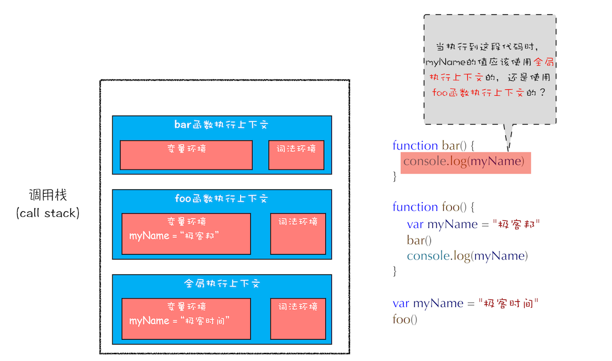
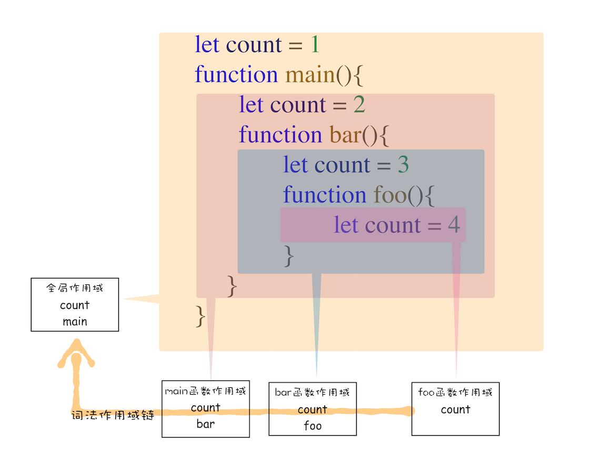

# 作用域链和闭包：代码中出现相同的变量，JS引擎是如何选择的

```
function bar() {
    console.log(myName)
}
function foo() {
    var myName = " 极客邦 "
    bar()
}
var myName = " 极客时间 "
foo()

```
输出“极客时间”  



## 作用域链
在每个执行上下文的变量环境中，都包含一个外部引用，用来指向外部的执行上下文，这个外部引用称之为**outer**  
当一段代码使用了一个变量时，JS引擎首先会在“当前的执行上下文”中查找该变量，如果在当前的变量环境中没有查找到，那么JS引擎会继续在outer所指向的执行上下文中查找。  


## 词法作用域
  
**词法作用域就是指作用域是由代码中函数声明的位置来决定的，所以词法作用域是静态的作用域，通过它就能够预测代码在执行过程中如何查找标识符**  

  

**词法作用域是根据代码的位置决定的**  

因为JavaScript作用域是由词法作用域决定的，所以整个词法作用域链的顺序是：foo函数作用域-->bar函数作用域-->main函数作用域-->全局作用域  

**词法作用域是代码阶段就决定好的，和函数是怎么调用的没有关系**

## 块级作用域中的变量查找
```
function bar() {
    var myName = " 极客世界 "
    let test1 = 100
    if (1) {
        let myName = "Chrome 浏览器 "
        console.log(test)
    }
}
function foo() {
    var myName = " 极客邦 "
    let test = 2
    {
        let test = 3
        bar()
    }
}
var myName = " 极客时间 "
let myAge = 10
let test = 1
foo()

```

  

查找过程按图中标出的顺序

## 闭包


```
function foo() {
    var myName = " 极客时间 "
    let test1 = 1
    const test2 = 2
    var innerBar = {
        getName:function(){
            console.log(test1)
            return myName
        },
        setName:function(newName){
            myName = newName
        }
    }
    return innerBar
}
var bar = foo()
bar.setName(" 极客邦 ")
bar.getName()
console.log(bar.getName())

```

  
  
  

foo函数执行完成后，其执行上下文从栈顶弹出，但由于返回的setName和getName方法中使用了foo函数内部的变量myName和test1，所以这两个变量依然保存在内存中。

## 闭包是怎么回收的
如果引用闭包的函数是一个全局变量，那么闭包会一直存在直到页面关闭；但如果这个闭包以后不再使用的话，就会造成内存泄漏。  

如果引用闭包的函数是个局部变量，等函数销毁后，在下次javascript引擎执行垃圾回收时，判断闭包这块内容如果已经不再被使用了，那么javascript引擎的垃圾回收器就会回收这块内存。

## 思考题
```
var bar = {
    myName:"time.geekbang.com",
    printName: function () {
        console.log(myName)
    }    
}
function foo() {
    let myName = " 极客时间 "
    return bar.printName
}
let myName = " 极客邦 "
let _printName = foo()
_printName()
bar.printName()

```

全局执行上下文：
变量环境：
Bar=undefined
Foo= function
词法环境：
myname = undefined
_printName = undefined

开始执行：
bar ={myname: "time.geekbang.com", printName: function(){...}}

myName = " 极客邦 "
 _printName = foo() 调用foo函数，压执行上下文入调用栈

foo函数执行上下文：
变量环境： 空
词法环境： myName=undefined
开始执行：
myName = " 极客时间 "
return bar.printName
开始查询变量bar， 查找当前词法环境（没有）->查找当前变量环境（没有） -> 查找outer词法环境（没有）-> 查找outer语法环境（找到了）并且返回找到的值
pop foo的执行上下文

_printName = bar.printName
printName（）压bar.printName方法的执行上下文入调用栈

bar.printName函数执行上下文：
变量环境： 空
词法环境： 空
开始执行：
console.log(myName)
开始查询变量myName， 查找当前词法环境（没有）->查找当前变量环境（没有） -> 查找outer词法环境（找到了）
打印" 极客邦 "
pop bar.printName的执行上下文


bar.printName() 压bar.printName方法的执行上下文入调用栈

bar.printName函数执行上下文：
变量环境： 空
词法环境： 空
开始执行：
console.log(myName)
开始查询变量myName， 查找当前词法环境（没有）->查找当前变量环境（没有） -> 查找outer词法环境（找到了）
打印" 极客邦 "
pop bar.printName的执行上下文
