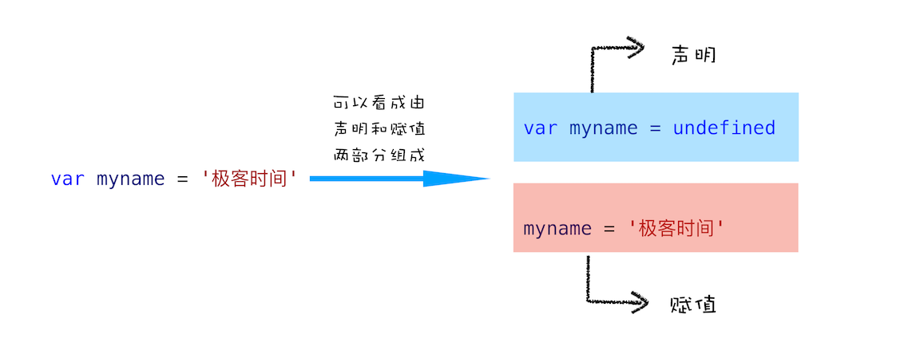

# 变量提升:JavaScript代码是按顺序执行的吗？

## 变量提升(Hoisting)
- 声明
- 赋值

  
  
  


**所谓的变量提升，是指在Js代码执行过程中，Js引擎把变量的声明部分和函数的声明部分提升到代码开头的“行为”。变量被提升后，会给变量设置默认值，这个默认值就是undefined**

## JavaScript代码的执行流程
实际上变量和函数声明在代码里的位置是不会改变的，而且是在编译阶段被JavaScript引擎放入内存中。编译完成后，才会进入执行阶段。  
  

### 1.编译阶段  
  

- 执行上下文是JavaScript执行一段代码时的运行环境
- 执行上下文中存在一个变量环境的对象(Viriable Environment),该对象中保存了变量提升的内容

### 2.执行阶段
当Js引擎开始执行“可执行代码”时，是按照顺序一行一行地执行的。

## 代码中出现相同的变量或者函数怎么办？
```
function showName() {
    console.log('极客邦');
}
showName();
function showName() {
    console.log('极客时间');
}
showName(); 

```
**一段代码如果定义了两个相同名字的函数，那么最终生效的是最后一个函数。**  

```
showName()
var showName = function() {
    console.log(2)
}
function showName() {
    console.log(1)
}

```
输出1

编译阶段:
var showName
function showName(){console.log(1)}

执行阶段:
showName()//输出1
showName=function(){console.log(2)}
//如果后面再有showName执行的话，就输出2因为这时候函数引用已经变了  

```
function hoistFunction() {
    foo(); // 2

    var foo = function() {
        console.log(1);
    };

    foo(); // 1

    function foo() {
        console.log(2);
    }

    foo(); // 1
}

hoistFunction();
```
预编译之后
```
// 预编译之后
function hoistFunction() {
    var foo;

    foo = function foo() {
        console.log(2);
    }

    foo(); // 2

    foo = function() {
        console.log(1);
    };

    foo(); // 1

    foo(); // 1
}

hoistFunction();
```