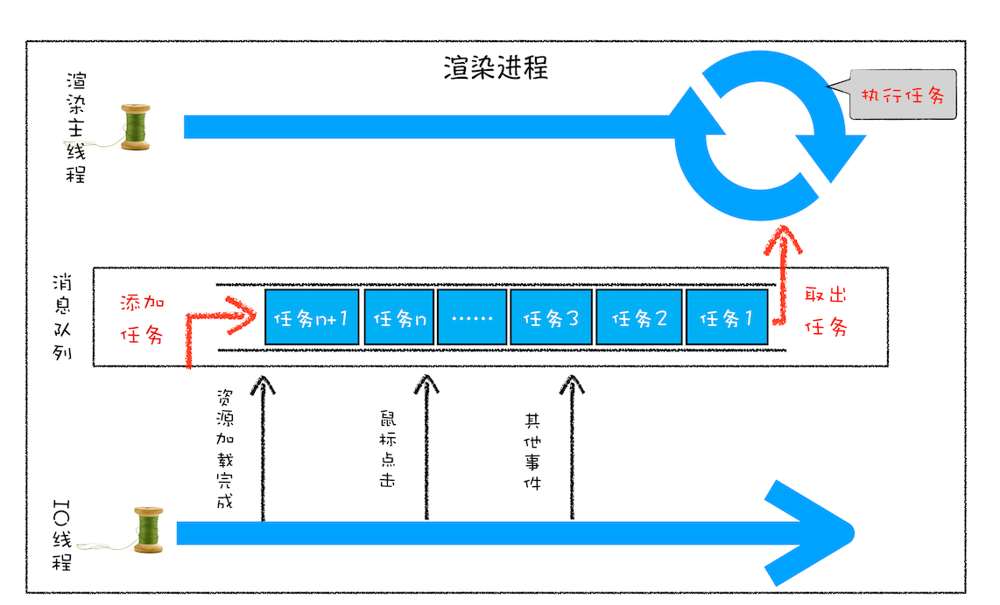

# 消息队列和事件循环：页面是怎么“活”起来的
## 使用单线程处理安排好的任务  
```
void MainThread(){
     int num1 = 1+2; // 任务 1
     int num2 = 20/5; // 任务 2
     int num3 = 7*8; // 任务 3
     print(" 最终计算的值为:%d,%d,%d",num,num2,num3)； // 任务 4
  }

```
  
## 在线程运行过程中处理新任务
**要想在线程运行过程中，能接收并执行新的任务，就需要采用事件循环机制**  
```
//GetInput
// 等待用户从键盘输入一个数字，并返回该输入的数字
int GetInput(){
    int input_number = 0;
    cout<<" 请输入一个数:";
    cin>>input_number;
    return input_number;
}

// 主线程 (Main Thread)
void MainThread(){
     for(;;){
          int first_num = GetInput()；
          int second_num = GetInput()；
          result_num = first_num + second_num;
          print(" 最终计算的值为:%d",result_num)；
      }
}

```
- **引入循环机制**，具体实现方式是在线程语句最后添加了一个**for循环语句**，线程会一直循环执行
- **引入了事件**，可以在线程运行过程中，等待用户输入的数字，等待过程中线程处于暂停状态，一旦接收到用户输入的信息，那么线程会被激活，然后执行相加运算，最后输出结果。  

  

## 处理其他线程发送过来的任务
  

渲染主线程会频繁接收来自IO线程的一些任务，然后渲染进程着手处理  

### 消息队列
  

消息队列存放要执行的任务，“先进先出”  

  

1. 添加一个消息队列
2. IO线程中产生的新任务添加进消息队列尾部
3. 渲染主线程会循环地从消息队列头部中读取任务，执行任务

### 按步骤使用代码来实现第三版的线程模型
1. 构造一个队列

```
class TaskQueue{
  public:
  Task takeTask(); // 取出队列头部的一个任务
  void pushTask(Task task); // 添加一个任务到队列尾部
};

```
2. 改造主线程，让主线程从队列中读取任务
```
TaskQueue task_queue；
void ProcessTask();
void MainThread(){
  for(;;){
    Task task = task_queue.takeTask();
    ProcessTask(task);
  }
}

```
添加一个消息队列的对象，然后在主线程的for循环代码块中，从消息队列中读取一个任务，然后执行该任务，主线程就这样一直循环往下执行，只要消息队列中有任务，主线程就会去执行  

3. 如果有其他线程想要发送任务让主线程去执行，只需将任务添加到该消息队列中  
```
Task clickTask;
task_queue.pushTask(clickTask)

```

## 处理其他进程发送过来的任务  
  

**渲染进程专门有一个IO进程用来接收其他进程传进来的消息**

## 如何安全退出
确定要退出当前页面时，页面主线程会设置一个**退出标志**的变量，在每次执行完一个任务时，判断是否有设置退出标志。  
如果设置了，那么直接中断当前的所有任务，退出线程  

```
TaskQueue task_queue；
void ProcessTask();
bool keep_running = true;
void MainThread(){
  for(;;){
    Task task = task_queue.takeTask();
    ProcessTask(task);
    if(!keep_running) // 如果设置了退出标志，那么直接退出线程循环
        break; 
  }
}

```

## 页面使用单线程的缺点
### 如何处理高优先级的任务
通常把消息队列中的任务称为**宏任务**，每个宏任务中都包含了一个**微任务队列**，在执行宏任务的过程中，如果DOM有变化，那么就会将该变化添加到微任务列表中，这样就不会影响到宏任务的继续执行，因此也就解决了执行效率的问题。  

等宏任务中的主要功能都直接完成后，渲染引擎并不着急去执行下一个宏任务，而是执行当前宏任务中的微任务，因为DOM变化的事件都保存在这些微任务队列中，这样也就解决了实时性问题。

### 如何解决单个任务执行时长过久的问题
  

JS通过回调功能来规避这种问题，让要执行的JS任务滞后后执行。